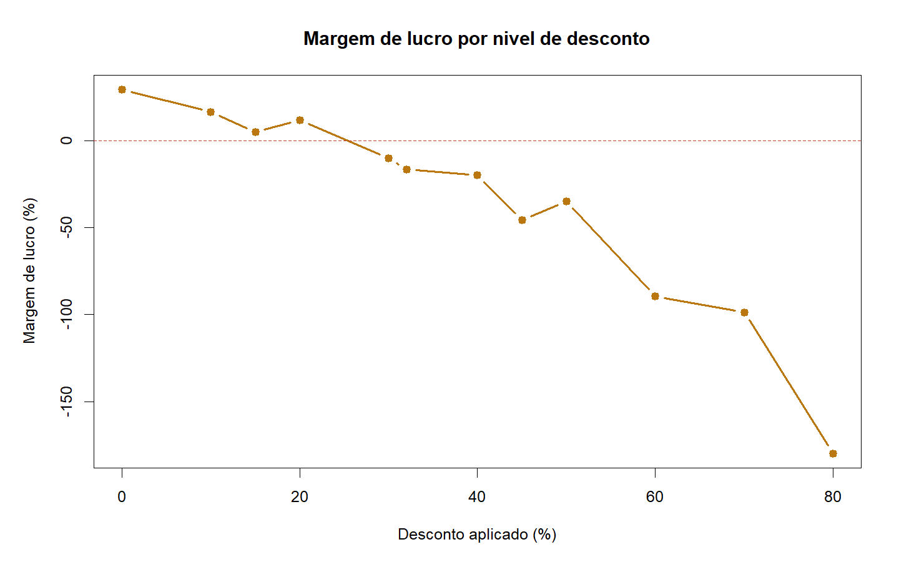
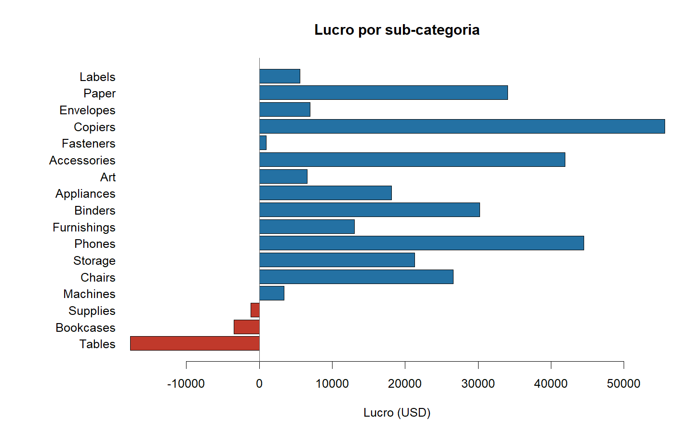
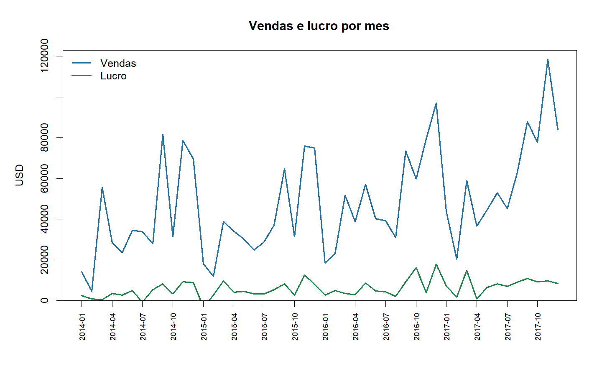

# Análise de Rentabilidade Comercial em R | Superstore

Análise reproduzível de **9.994 encomendas** de uma loja de material de escritório e mobiliário
(dataset Sample Superstore) para perceber onde está o lucro — e onde está a ser destruído.

**Stack:** R 4.5.2 · apenas R base · sem dependências externas

---

## Resultado principal

> **Descontos a partir de 30% dão sempre prejuízo.**
> Até 20% de desconto a margem mantém-se positiva. A 30% a margem passa a −10%.
> A 80% a empresa perde 1,80 USD por cada 1 USD vendido.



| Desconto | Vendas (USD) | Lucro (USD) | Margem | Encomendas |
|---:|---:|---:|---:|---:|
| 0% | 1 087 908 | +320 988 | **+29,5%** | 4 798 |
| 10% | 54 369 | +9 029 | +16,6% | 94 |
| 15% | 27 559 | +1 419 | +5,1% | 52 |
| 20% | 764 594 | +90 337 | +11,8% | 3 657 |
| 30% | 103 227 | −10 369 | **−10,0%** | 227 |
| 40% | 116 418 | −23 057 | −19,8% | 206 |
| 50% | 58 919 | −20 506 | −34,8% | 66 |
| 70% | 40 620 | −40 075 | −98,7% | 418 |
| 80% | 16 964 | −30 539 | **−180,0%** | 300 |

A leitura prática: as 1.393 encomendas com desconto ≥30% custaram cerca de **135 mil USD** de
lucro. Um limite máximo de desconto em 20% recuperaria a maior parte desse valor.

## Restantes conclusões

**Três sub-categorias dão prejuízo:**

| Sub-categoria | Vendas | Lucro | Margem |
|---|---:|---:|---:|
| Tables | 206 966 | **−17 725** | −8,6% |
| Bookcases | 114 880 | −3 473 | −3,0% |
| Supplies | 46 674 | −1 189 | −2,5% |



**As melhores margens não são os maiores produtos:** Labels 44,4%, Paper 43,4% e Envelopes 42,3%
lideram em rentabilidade, mas somam pouco volume. Copiers combina boa margem (37,2%) com
volume relevante (149 528 USD).

**Por categoria:** Technology 17,4% · Office Supplies 17,0% · Furniture apenas **2,5%**.
Furniture vende quase tanto quanto Technology (742 mil vs 836 mil USD) e gera sete vezes menos
lucro — é aqui que estão Tables e Bookcases.

**Por região:** West 14,9% · East 13,5% · South 11,9% · Central **7,9%**.

**Evolução mensal** de vendas e lucro em `07_TABELAS/performance_monthly.csv`.



## Método

1. **Importação** — CSV lido com codificação Latin-1 (o ficheiro tem caracteres acentuados nos nomes).
2. **Inspeção** — dimensões, valores em falta e duplicados exatos medidos antes da limpeza.
3. **Limpeza** — nomes em *snake_case*; marcadores textuais de ausência convertidos em `NA`.
4. **Transformação** — datas convertidas e **validadas**: o pipeline falha se alguma data não for
   interpretável ou se alguma expedição for anterior à encomenda. Derivam-se `order_year`,
   `order_month`, `prazo_envio` e `profit_margin`.
5. **Validação** — registo de qualidade em `07_TABELAS/validacao_limpeza.csv`.
6. **Análise, gráficos e exportação.**

**Qualidade dos dados:** 9.994 linhas → 9.994 linhas · 0 valores em falta · 0 duplicados exatos ·
0 linhas removidas.

## Reproduzir

```bash
Rscript 04_SCRIPTS_R/09_executar_pipeline.R
```

Correr a partir da raiz do projeto. Não é preciso instalar pacotes.

## Estrutura

```
01_DADOS_BRUTOS/    CSV original, imutável
03_DADOS_LIMPOS/    dados tratados, gerados pelo pipeline
04_SCRIPTS_R/       9 etapas, uma por ficheiro
05_NOTEBOOKS/       notebook R Markdown para Kaggle
06_GRAFICOS/        gráficos PNG
07_TABELAS/         tabelas de resultados em CSV
09_DOCUMENTACAO/    dicionário de dados e dependências
```

## Limitações

Os dados são observacionais. A associação entre desconto alto e prejuízo é clara, mas o desconto
pode estar a ser aplicado precisamente aos produtos já pouco rentáveis ou a stock encalhado — o
sentido da relação não fica provado por esta análise. Antes de impor um limite de desconto seria
preciso perceber que regra comercial gerou os descontos existentes.

## Dados

Sample Superstore — dataset de demonstração distribuído com o Tableau e amplamente
republicado no Kaggle. Dados fictícios. O CSV original está em `01_DADOS_BRUTOS` sem alterações.

## Licença

Código sob licença MIT (ver `LICENSE`). O dataset mantém os termos da fonte original.
